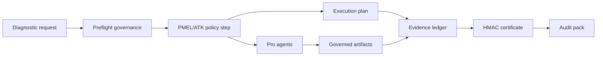
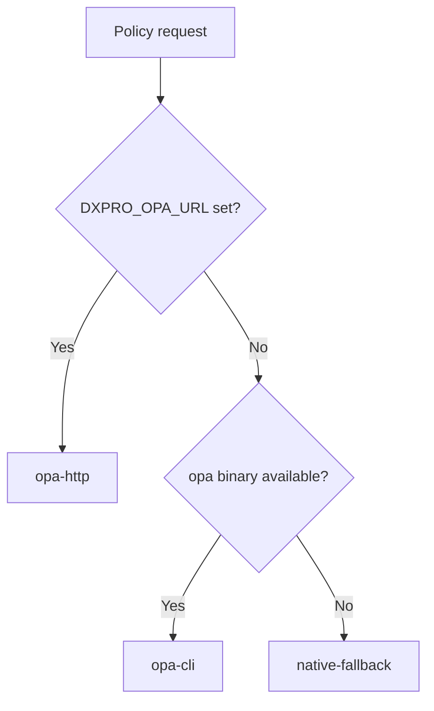

# ARHIAX DX Pro Runtime

[](https://www.python.org/)
[](https://fastapi.tiangolo.com/)
[](https://www.openpolicyagent.org/)
[](#governance-model)

Standalone governed diagnostic runtime for **ARHIAX DX Pro**.

DX Pro does not import or depend on the base `arhiax_dx` package. It ships its
own catalog, PMEL/ATK policy layer, evidence ledger, diagnostic orchestration,
Pro agents, OPA bundle and provenance certificates.

---

## What This Runtime Does

ARHIAX DX Pro turns a diagnostic request into a governed, auditable execution:



Core outcomes:

| Layer | Responsibility |
| --- | --- |
| Diagnostic service | Validates client identity, mandate, boundary, tools, operations, data scopes, QA, IRR, retention and publication gates. |
| PMEL/ATK runtime | Evaluates policy packages and aggregates outcomes by severity. |
| Evidence ledger | Stores append-only HMAC-chained evidence entries. |
| Provenance | Issues and verifies HMAC-SHA256 diagnostic certificates. |
| OPA bundle | Provides the primary policy path for PMEL governance. |
| Pro agents | Generate governed artifacts only after policy approval. |

---

## Status

Current state: **standalone vertical runtime**.

- OPA is the primary policy path.
- Native fallback exists for development/degraded mode.
- The native fallback covers all packages declared in `policy-bundle-pmel-v1.0.0/manifest.json`.
- API-key authentication and rate limiting are enforced when keys or production mode are configured.
- PMEL consent is fail-closed: omitted consent is treated as missing consent, not as approval.

---

## Repository Map

```text
.
|-- .github/workflows/ci.yml
|-- docs/
|   |-- ARCHITECTURE.md
|   |-- GOVERNANCE_SPEC.md
|   |-- DX_TO_DXPRO_MATRIX.md
|   `-- BITACORA_ARHIAX_DX_PRO.md
|-- fixtures/
|-- policy-bundle-pmel-v1.0.0/
|   |-- base/
|   |-- pmel_governance/
|   |-- bpmn_lint/
|   |-- decommissioning/
|   |-- data/
|   |-- tests/
|   `-- manifest.json
|-- scripts/
|-- src/dxpro_runtime/
`-- tests/
```

---

## Quickstart

### 1. Install

```powershell
python -m pip install --upgrade pip
python -m pip install -e ".[dev]"
```

### 2. Run tests

```powershell
python -m pytest -q
```

### 3. Run the API

```powershell
python -m dxpro_runtime.server
```

Default service:

```text
http://127.0.0.1:8310
```

OpenAPI docs:

```text
http://127.0.0.1:8310/docs
```

### 4. Smoke test

```powershell
python scripts/smoke_test.py
```

---

## Configuration

| Variable | Required | Purpose |
| --- | --- | --- |
| `DXPRO_ENV` | No | `development` by default. Use `production` for hardened startup checks. |
| `DXPRO_RUNTIME_ROOT` | No | Runtime root. Defaults to current working directory. |
| `DXPRO_LEDGER_PATH` | No | Evidence ledger path. Defaults to `data/evidence.jsonl`. |
| `DXPRO_EVIDENCE_SECRET` | Production | Secret used for evidence HMAC and certificates. Must be strong in production. |
| `DXPRO_POLICY_BUNDLE_PATH` | No | PMEL policy bundle path. Defaults to `policy-bundle-pmel-v1.0.0`. |
| `DXPRO_OPA_URL` | No | OPA HTTP server URL. Enables `opa-http` mode. |
| `DXPRO_API_KEYS` | Production | Comma-separated API keys for protected endpoints. |
| `DXPRO_RATE_LIMIT_PER_MINUTE` | No | Per-key rate limit. Defaults to `60`. |
| `DXPRO_RATE_LIMIT_BURST` | No | Optional token-bucket burst size. |
| `ANTHROPIC_API_KEY` | Production | Enables Claude-backed Pro agents. Required in production. |
| `LENS_API_TOKEN` | No | Enables Lens.org patent search for RGC. |
| `OPENALEX_CONTACT_EMAIL` | No | Polite-pool contact for OpenAlex paper search. |

Development example:

```powershell
$env:DXPRO_ENV = "development"
$env:DXPRO_EVIDENCE_SECRET = "local-dev-secret-change-this-32chars"
python -m dxpro_runtime.server
```

Production minimum:

```powershell
$env:DXPRO_ENV = "production"
$env:DXPRO_EVIDENCE_SECRET = "<strong-32-plus-character-secret>"
$env:DXPRO_API_KEYS = "<strong-api-key-1>,<strong-api-key-2>"
$env:ANTHROPIC_API_KEY = "<anthropic-key>"
python -m dxpro_runtime.server
```

---

## Governance Model

DX Pro aggregates PMEL policy outcomes using ATK priority:

| Priority | Outcome | Meaning |
| ---: | --- | --- |
| 1 | `SUSPEND` | Stop the process immediately. |
| 2 | `DENY` | Block the requested action. |
| 3 | `ESCALATE` | Require human review. |
| 4 | `MODIFY` | Permit only with required modification. |
| 5 | `AUDIT` | Permit but log/audit the condition. |
| 6 | `PERMIT` | Allow execution. |

Default `run-step` packages:

- `arhia.pmel.base.autonomy`
- `arhia.pmel.governance.consent_gates`
- `arhia.pmel.base.aibom`
- `arhia.pmel.governance.cycle_limits`

Full bundle mode evaluates every package declared by the manifest:

```json
{
  "subject": "pmel-full-bundle",
  "scope": "full_bundle",
  "input": {}
}
```

---

## Policy Engine

Policy mode selection:



Validate the policy bundle:

```powershell
python scripts/validate_opa.py
```

The validator uses a local `opa` binary when available. If not, it tries Docker
with `openpolicyagent/opa:0.68.0-rootless`.

---

## API Surface

Public endpoints:

| Method | Path | Purpose |
| --- | --- | --- |
| `GET` | `/` | Service discovery. |
| `GET` | `/healthz` | Liveness probe. |
| `GET` | `/readyz` | Readiness and runtime mode. |

Protected endpoints:

| Method | Path | Purpose |
| --- | --- | --- |
| `GET` | `/v1/compliance/posture` | Runtime posture, catalog, policy coverage and ledger head. |
| `GET` | `/v1/compliance/install-readiness` | Install checks and required bindings. |
| `GET` | `/v1/compliance/install-blueprint` | Deployment binding blueprint. |
| `POST` | `/v1/diagnostics/evaluate` | Full governed DX Pro diagnostic evaluation. |
| `POST` | `/v1/pmel/evaluate` | Evaluate one PMEL policy package. |
| `POST` | `/v1/pmel/run-step` | Evaluate and aggregate a PMEL policy chain. |
| `POST` | `/v1/pmel/capture` | Governed PMEL capture draft. |
| `GET` | `/v1/evidence` | Recent evidence entries. |
| `GET` | `/v1/evidence?trace_id={trace_id}` | Evidence entries for one trace. |
| `GET` | `/v1/pmel/runs/{trace_id}` | PMEL run evidence for one trace. |
| `GET` | `/v1/evidence/verify` | Verify the full HMAC chain. |
| `POST` | `/v1/certificates/verify` | Verify diagnostic certificate trust. |
| `GET` | `/v1/audit-pack/{trace_id}` | Complete audit pack for a trace. |

DX Pro aliases are also available:

- `/v1/dxpro/pmel/evaluate`
- `/v1/dxpro/pmel/run-step`
- `/v1/dxpro/pmel/capture`

---

## Diagnostic Evaluate

`POST /v1/diagnostics/evaluate` performs the full governed diagnostic path:

1. Validate client identity and authorization boundary.
2. Validate mandate, tools, operations and data scopes.
3. Check autonomy, anonymization, prompt-injection signals and operating window.
4. Check QA, publication, delta sigma, IRR and retention gates.
5. Run PMEL pre-execution governance.
6. Build an execution plan.
7. Append diagnostic evidence.
8. Issue a provenance certificate when enabled.

Minimal successful payload:

```json
{
  "requested_autonomy_level": "A1",
  "mandate": {
    "organization_name": "Cliente Demo",
    "domain": "diagnostico organizacional",
    "subprocess": "evaluacion",
    "size_org": "120",
    "objective": "Diagnosticar cuellos de botella"
  },
  "client": {
    "client_id": "client-001",
    "legal_name": "Cliente Demo S.A.S.",
    "authorized_boundary_id": "boundary-diagnostico-org-pro"
  },
  "processing_profile": {
    "issue_certificate": true,
    "retention_days": 30
  },
  "simulation": {
    "current_weekday": 2,
    "current_hour": 10,
    "qa_score": 95,
    "irr_alpha": 0.8
  },
  "pmel": {
    "consents": {
      "T1": true,
      "T3": true
    }
  }
}
```

Important: `pmel.consents` is required for PMEL approval. If consent is omitted,
the PMEL aggregate returns `DENY`.

Response includes:

- `decision`
- `execution_plan`
- `pmel_step`
- `certificate`
- `rule_results`
- `trace_id`
- `evidence_id`
- `certificate_evidence_id`

---

## Evidence And Audit

The ledger is append-only and HMAC-chained.

When certificate issuance is enabled, a successful diagnostic evaluation writes
seven evidence entries:

| Sequence | Event |
| ---: | --- |
| 1-4 | PMEL `policy_decision` entries. |
| 5 | PMEL `pmel_step_aggregate`. |
| 6 | `diagnostic_evaluation`. |
| 7 | `provenance_certificate`. |

Verify ledger:

```powershell
Invoke-RestMethod http://127.0.0.1:8310/v1/evidence/verify
```

Verify certificate:

```json
{
  "certificate": {}
}
```

Get audit pack:

```text
GET /v1/audit-pack/{trace_id}
```

The audit pack contains:

- ledger verification result
- diagnostic evidence IDs
- PMEL evidence IDs
- certificate evidence IDs
- certificate verification results
- ordered evidence entries for the trace

---

## Pro Agents

Every Pro agent runs PMEL governance before producing an artifact.

| Agent | Endpoint | Artifact |
| --- | --- | --- |
| `PmelToBeGenerator` | `/v1/agents/to-be/generate` | `pmel_to_be_blueprint` |
| `PmelBpmnLintAgent` | `/v1/agents/bpmn-lint` | `pmel_bpmn_lint_report` |
| `PmelVisualInterpreter` | `/v1/agents/visual-interpret` | `pmel_visual_interpretation` |
| `DmnEngine` | `/v1/agents/dmn/evaluate` | `dmn_decision_result` |
| `CryptoParticipant` | `/v1/agents/crypto/decommission` | `crypto_decommissioning_plan` |
| `RgcAgent` | `/v1/agents/research/build-hypothesis-pack` | `pmel_hypothesis_pack` |

Consent is explicit:

```json
{
  "consent": {
    "action": "ingest_to_llm",
    "consents": {
      "T1": true,
      "T3": true
    }
  }
}
```

If governance returns `DENY`, `ESCALATE` or `SUSPEND`, the response keeps
`artifact` as `null`.

---

## Fixtures

Reusable local fixtures:

| Fixture | Purpose |
| --- | --- |
| `fixtures/run_step_permit.json` | Happy-path PMEL step. |
| `fixtures/run_step_missing_consent.json` | Consent-denied PMEL step. |
| `fixtures/run_step_autonomy_a3.json` | Autonomy above DX Pro maximum. |
| `fixtures/run_step_cycle_suspend.json` | Cycle-limit suspension. |
| `fixtures/capture_permit.json` | Governed PMEL capture. |
| `fixtures/diagnostic_permit.json` | Governed diagnostic evaluation. |

Run a fixture:

```powershell
python scripts/run_fixture.py fixtures/run_step_permit.json
```

---

## Quality Gates

Local validation:

```powershell
python -m pytest -q
python scripts/smoke_test.py
python scripts/validate_opa.py
```

CI validation in `.github/workflows/ci.yml`:

1. Install package.
2. Run unit and API tests.
3. Run smoke test.
4. Install OPA.
5. Validate the OPA bundle.

---

## Security Notes

- Production refuses the default development evidence secret.
- Production requires API keys.
- Production requires `ANTHROPIC_API_KEY`.
- API keys are checked with constant-time comparison.
- Rate limiting is per API-key fingerprint.
- Evidence HMACs do not expose the API key or raw secret.
- PMEL consent gates fail closed when consent is missing.
- Decommissioning agent is `plan_only`; it does not destroy data.

---

## Useful Commands

```powershell
# Show repo state
git status

# Run the server
python -m dxpro_runtime.server

# Run all tests
python -m pytest -q

# Run one test file
python -m pytest tests/test_api.py -q

# Validate OPA bundle
python scripts/validate_opa.py

# Smoke test
python scripts/smoke_test.py
```

---

## Related Docs

- [`docs/ARCHITECTURE.md`](docs/ARCHITECTURE.md)
- [`docs/GOVERNANCE_SPEC.md`](docs/GOVERNANCE_SPEC.md)
- [`docs/DX_TO_DXPRO_MATRIX.md`](docs/DX_TO_DXPRO_MATRIX.md)
- [`policy-bundle-pmel-v1.0.0/README.md`](policy-bundle-pmel-v1.0.0/README.md)
