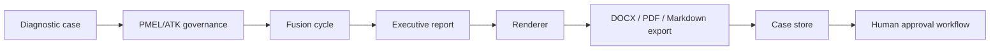

# ARHIAX DX Pro

[](https://www.python.org/)
[](https://fastapi.tiangolo.com/)
[](frontend/arhiax-dxpro-site)
[](https://www.openpolicyagent.org/)
[](#governance)

Standalone governed diagnostic product for **ARHIAX DX Pro**, owned by Sinergia Consulting Group.

DX Pro is not a fork-time dependency of `arhiax_dx`. It ships its own runtime, PMEL/ATK governance, OPA policy bundle, evidence ledger, diagnostic agents, case persistence, approval workflow, report exports and frontend console.

## Current State

Current state: **preproduction functional product**.

- Backend runtime is implemented with FastAPI under `src/dxpro_runtime`.
- Frontend operating console is implemented under `frontend/arhiax-dxpro-site`.
- CI is green on `main`.
- Local validation currently covers `127` backend tests.
- The system can run a governed diagnostic case end to end and produce Markdown, DOCX and PDF deliverables.

## What DX Pro Does



Core capabilities:

| Layer | Responsibility |
| --- | --- |
| Runtime governance | PMEL/ATK policy execution, autonomy caps, consent gates, AIBOM validation and cycle limits. |
| Evidence | Append-only HMAC ledger, trace evidence, certificate verification and audit packs. |
| Diagnostic fusion | Adaptive questions, multi-role scoring, psychometrics, IRR, Bayesian synthesis, RGC, deep research contrast, TO-BE, BPMN lint and executive QA. |
| Reporting | Executive report pack, UTF-8 render pack and physical Markdown/DOCX/PDF exports. |
| Case operations | Persisted diagnostic cases, full case runner and human approval/publication workflow. |
| Frontend | Operator console for running cases, viewing status, approving and locating deliverables. |

## Repository Map

```text
.
|-- .github/workflows/ci.yml
|-- docs/
|   |-- ARCHITECTURE.md
|   |-- GOVERNANCE_SPEC.md
|   |-- DX_TO_DXPRO_MATRIX.md
|   `-- BITACORA_ARHIAX_DX_PRO.md
|-- frontend/
|   `-- arhiax-dxpro-site/
|-- fixtures/
|-- policy-bundle-pmel-v1.0.0/
|-- scripts/
|-- src/dxpro_runtime/
`-- tests/
```

## Quickstart

Install backend dependencies:

```powershell
python -m pip install --upgrade pip
python -m pip install -e ".[dev]"
```

Run backend tests:

```powershell
python -m pytest -q
```

Run the API:

```powershell
python -m dxpro_runtime.server
```

Default API service:

```text
http://127.0.0.1:8310
```

OpenAPI docs:

```text
http://127.0.0.1:8310/docs
```

Run the frontend console:

```powershell
cd frontend/arhiax-dxpro-site
npm install
npm run dev
```

The frontend uses this API base by default:

```text
http://127.0.0.1:8310
```

Set it explicitly for deployment:

```powershell
$env:VITE_DXPRO_API_URL = "http://127.0.0.1:8310"
```

## Configuration

| Variable | Required | Purpose |
| --- | --- | --- |
| `DXPRO_ENV` | No | `development` by default. Use `production` for hardened startup checks. |
| `DXPRO_RUNTIME_ROOT` | No | Runtime root. Defaults to current working directory. |
| `DXPRO_LEDGER_PATH` | No | Evidence ledger path. Defaults to `data/evidence.jsonl`. |
| `DXPRO_CASE_STORE_ROOT` | No | Local persisted case store. Defaults to `data/cases`. |
| `DXPRO_EXPORT_ROOT` | No | Local report export folder. Defaults to `data/exports`. |
| `DXPRO_EVIDENCE_SECRET` | Production | Secret used for evidence HMAC and certificates. Must be strong in production. |
| `DXPRO_POLICY_BUNDLE_PATH` | No | PMEL policy bundle path. Defaults to `policy-bundle-pmel-v1.0.0`. |
| `DXPRO_OPA_URL` | No | OPA HTTP server URL. Enables `opa-http` mode. |
| `DXPRO_API_KEYS` | Production | Comma-separated API keys for protected endpoints. |
| `DXPRO_RATE_LIMIT_PER_MINUTE` | No | Per-key rate limit. Defaults to `60`. |
| `DXPRO_RATE_LIMIT_BURST` | No | Optional token-bucket burst size. |
| `ANTHROPIC_API_KEY` | Production | Enables Claude-backed Pro agents. Required in production. |
| `LENS_API_TOKEN` | No | Enables Lens.org patent search for RGC. |
| `OPENALEX_CONTACT_EMAIL` | No | Polite-pool contact for OpenAlex paper search. |

## Main API Surface

Public:

| Method | Path | Purpose |
| --- | --- | --- |
| `GET` | `/` | Service discovery. |
| `GET` | `/healthz` | Liveness probe. |
| `GET` | `/readyz` | Readiness and runtime mode. |

Governance and evidence:

| Method | Path | Purpose |
| --- | --- | --- |
| `GET` | `/v1/compliance/posture` | Runtime posture, catalog, policy coverage and ledger head. |
| `POST` | `/v1/pmel/evaluate` | Evaluate one PMEL policy package. |
| `POST` | `/v1/pmel/run-step` | Evaluate and aggregate a PMEL policy chain. |
| `GET` | `/v1/evidence` | Recent evidence entries. |
| `GET` | `/v1/evidence/verify` | Verify the full HMAC chain. |
| `GET` | `/v1/audit-pack/{trace_id}` | Complete audit pack for a trace. |

Diagnostic and case operations:

| Method | Path | Purpose |
| --- | --- | --- |
| `POST` | `/v1/diagnostics/evaluate` | Full governed diagnostic evaluation. |
| `POST` | `/v1/agents/diagnostic/run-fusion-cycle` | Run the governed fusion chain. |
| `POST` | `/v1/agents/report/executive` | Generate an executive report pack. |
| `POST` | `/v1/agents/report/render` | Generate a UTF-8 render pack. |
| `POST` | `/v1/agents/report/export` | Export Markdown, DOCX and PDF files. |
| `POST` | `/v1/agents/cases/run` | Run a case end to end and persist it. |
| `POST` | `/v1/agents/cases/approval` | Approve, reject, resubmit or publish a case. |
| `GET` | `/v1/cases` | List persisted cases. |
| `GET` | `/v1/cases/{case_id}` | Retrieve one persisted case. |

## Governance

DX Pro aggregates PMEL policy outcomes using ATK priority:

| Priority | Outcome | Meaning |
| ---: | --- | --- |
| 1 | `SUSPEND` | Stop the process immediately. |
| 2 | `DENY` | Block the requested action. |
| 3 | `ESCALATE` | Require human review. |
| 4 | `MODIFY` | Permit only with required modification. |
| 5 | `AUDIT` | Permit but log/audit the condition. |
| 6 | `PERMIT` | Allow execution. |

Default Pro agent pre-execution packages:

- `arhia.pmel.base.autonomy`
- `arhia.pmel.governance.consent_gates`
- `arhia.pmel.base.aibom`
- `arhia.pmel.governance.cycle_limits`

Consent is fail-closed. If required consent is omitted, governed agents return no artifact.

## Quality Gates

Local validation:

```powershell
python -m pytest -q
python scripts/smoke_test.py
python scripts/validate_opa.py

cd frontend/arhiax-dxpro-site
npm run build
```

CI validation in `.github/workflows/ci.yml`:

1. Install package.
2. Run unit and API tests.
3. Run smoke test.
4. Install OPA.
5. Validate the OPA bundle.

## Production Readiness Notes

Already implemented:

- Runtime governance and evidence.
- API-key auth and rate limiting.
- OPA-first policy mode.
- Native fallback for declared packages.
- Case persistence and local export storage.
- Human approval workflow.
- Frontend console.

Still required for production deployment:

- Strong production secrets.
- Real deployment target and process manager/container.
- Frontend auth against protected API endpoints.
- Download endpoints or object storage for exported deliverables.
- Observability, logs and backup policy.
- Final QA of responsive frontend flows.

## Related Docs

- [`docs/ARCHITECTURE.md`](docs/ARCHITECTURE.md)
- [`docs/GOVERNANCE_SPEC.md`](docs/GOVERNANCE_SPEC.md)
- [`docs/DX_TO_DXPRO_MATRIX.md`](docs/DX_TO_DXPRO_MATRIX.md)
- [`frontend/arhiax-dxpro-site/README.md`](frontend/arhiax-dxpro-site/README.md)
- [`policy-bundle-pmel-v1.0.0/README.md`](policy-bundle-pmel-v1.0.0/README.md)
