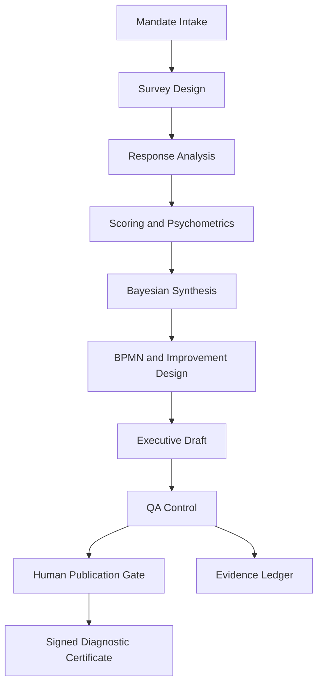

# Architecture

## Overview

ARHIAX Dx Agent is a governed diagnostics control plane for organizational analysis.

It packages:

- intake and mandate validation
- survey and instrument orchestration
- scoring and psychometrics
- Bayesian reasoning
- process redesign planning
- report drafting
- QA and publication gates

## Packaged Pipeline

## Architecture Sources Used

This repo was shaped from three existing Dx inputs:

1. `ARHIAX-Briefing-DxAgente.docx`
2. `ARQUITECTURA_AGENTICA_GOBERNADA_LOGISTICA_CO.md`
3. legacy `ARHIA V3/arhia_dx_core/backend/`

The repo does not copy those assets directly into runtime behavior. Instead, it packages the reusable governance patterns:

- closed catalogs
- explicit boundaries
- human approval gates
- audit-ready evidence
- install-time secret injection

## Runtime Components

| Component | Responsibility |
|---|---|
| `main.py` | FastAPI application surface |
| `tool_registry.py` | Loads the packaged governance contract from `specs/` |
| `governance.py` | Enforces request-time and execution-time policy checks |
| `diagnostics.py` | Builds governed execution plans and responses |
| `evidence.py` | Maintains append-only evidence entries |
| `provenance.py` | Issues signed execution certificates |
| `installation.py` | Reports install readiness |
| `installation_assets.py` | Generates the install manifest template |

## Separation of Concerns

| Layer | Delivered by Repo | Delivered at Install Time |
|---|---|---|
| Governance logic | Yes | No |
| Tool catalog | Yes | No |
| Policy versioning | Yes | No |
| Signing behavior | Yes | Key material only |
| Model fallback logic | Yes | Provider keys only |
| Human escalation policy | Yes | Actual webhook endpoints only |
| Client infra | No | Yes |

## Human Governance

The agent is intentionally not a fully autonomous publisher.

Hard gates:

- report publication
- autonomy promotion to `A2`
- critical gap review when `delta_sigma > 2`
- low IRR follow-up when `irr_alpha < 0.70`

## Install-Time Philosophy

The repo is designed so that missing production pieces are not future development tasks. They are deployment bindings:

- secrets
- channels
- KMS/HSM
- observability
- renderers

This keeps the agent logic stable while allowing the client to host it inside their own environment.
