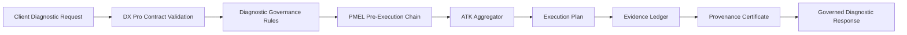

# ARHIAX DX Pro Architecture

## Positioning

ARHIAX DX Pro is a standalone governed diagnostic runtime. It covers the same business surface as ARHIAX DX, but it is not a fork-time dependency of the previous DX runtime.

DX Pro owns its own:

- diagnostic governance catalog
- PMEL policy chain
- ATK outcome aggregation
- evidence ledger
- provenance certificate layer
- install-readiness contract
- runtime API

The previous ARHIAX DX repository is treated as an architectural reference only.

## Product Boundary

| Area | DX Pro Ownership |
|---|---|
| Runtime package | `dxpro_runtime` |
| Product identity | `ARHIAX-DxPro-v1` |
| Authorization boundary | `boundary-diagnostico-org-pro` |
| Governance standard | `ARHIAX PMEL/ATK` |
| Evidence | Local append-only JSONL ledger with HMAC chaining |
| Policy mode | Native fallback or external OPA through `DXPRO_OPA_URL` |
| Deployment style | Client-hosted standalone service |

## High-Level Flow

## Runtime Components

| Component | Responsibility |
|---|---|
| `catalog.py` | Standalone DX Pro identity, tool catalog, scopes, operations, autonomy profile and BBR baseline |
| `diagnostics.py` | Full governed diagnostic evaluation and final ATK decision |
| `policy.py` | Policy evaluation through OPA or native fallback |
| `runtime.py` | PMEL step orchestration and ATK aggregation |
| `capture_agent.py` | First governed PMEL agent stub for process interview intake |
| `evidence.py` | Append-only HMAC ledger with interprocess file lock |
| `provenance.py` | HMAC-SHA256 provenance certificates |
| `api.py` | FastAPI application surface |
| `server.py` | Uvicorn launcher for local and packaged runtime execution |

## API Surface

| Endpoint | Purpose |
|---|---|
| `GET /healthz` | Liveness |
| `GET /readyz` | Runtime readiness |
| `GET /v1/compliance/posture` | DX Pro governance contract |
| `GET /v1/compliance/install-readiness` | Install binding readiness |
| `GET /v1/compliance/install-blueprint` | Required client bindings |
| `POST /v1/diagnostics/evaluate` | Full governed diagnostic evaluation |
| `POST /v1/pmel/evaluate` | Single PMEL policy evaluation |
| `POST /v1/pmel/run-step` | PMEL chain execution |
| `POST /v1/pmel/capture` | Governed PMEL capture draft |
| `GET /v1/evidence` | Recent evidence entries |
| `GET /v1/evidence?trace_id={trace_id}` | Evidence by trace |
| `GET /v1/pmel/runs/{trace_id}` | Trace run view |
| `GET /v1/evidence/verify` | Ledger HMAC verification |

## Policy Execution

DX Pro supports two policy modes:

- Native fallback for core PMEL packages used in early vertical slices.
- OPA delegation when `DXPRO_OPA_URL` is configured.

Native fallback currently covers:

- `arhia.pmel.base.autonomy`
- `arhia.pmel.governance.consent_gates`
- `arhia.pmel.base.aibom`
- `arhia.pmel.governance.cycle_limits`

## Evidence Model

Every governed decision writes evidence. A default diagnostic evaluation writes:

1. Four `policy_decision` entries from the PMEL chain.
2. One `pmel_step_aggregate` entry.
3. One `diagnostic_evaluation` entry.

The ledger is HMAC chained and protected by a lock file during reads and writes.

## Deployment Contract

Required runtime bindings:

- `DXPRO_EVIDENCE_SECRET`
- `DXPRO_POLICY_BUNDLE_PATH`
- `DXPRO_LEDGER_PATH`
- client model provider keys
- human intervention channel
- observability stack

Optional binding:

- `DXPRO_OPA_URL`
