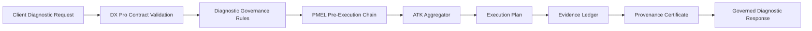

# ARHIAX DX Pro Architecture

## Positioning

ARHIAX DX Pro is a standalone governed diagnostic runtime. It covers the same business surface as ARHIAX DX, but it is not a fork-time dependency of the previous DX runtime.

DX Pro owns its own:

- diagnostic governance catalog
- PMEL policy chain
- ATK outcome aggregation
- evidence ledger
- provenance certificate layer
- install-readiness contract
- runtime API

The previous ARHIAX DX repository is treated as an architectural reference only.

## Product Boundary

| Area | DX Pro Ownership |
|---|---|
| Runtime package | `dxpro_runtime` |
| Product identity | `ARHIAX-DxPro-v1` |
| Authorization boundary | `boundary-diagnostico-org-pro` |
| Governance standard | `ARHIAX PMEL/ATK` |
| Evidence | Local append-only JSONL ledger with HMAC chaining |
| Policy mode | Native fallback or external OPA through `DXPRO_OPA_URL` |
| Deployment style | Client-hosted standalone service |

## High-Level Flow

## Runtime Components

| Component | Responsibility |
|---|---|
| `catalog.py` | Standalone DX Pro identity, tool catalog, scopes, operations, autonomy profile and BBR baseline |
| `diagnostics.py` | Full governed diagnostic evaluation and final ATK decision |
| `policy.py` | Policy evaluation through OPA or native fallback |
| `runtime.py` | PMEL step orchestration and ATK aggregation |
| `capture_agent.py` | First governed PMEL agent stub for process interview intake |
| `pro_agents.py` | Governed DX Pro agents for TO-BE generation, BPMN lint, visual interpretation, DMN evaluation, crypto decommissioning, RGC research, adaptive questions, scoring, psychometrics, IRR, Bayesian synthesis, executive QA and diagnostic intelligence |
| `evidence.py` | Append-only HMAC ledger with interprocess file lock |
| `provenance.py` | HMAC-SHA256 provenance certificates |
| `api.py` | FastAPI application surface |
| `server.py` | Uvicorn launcher for local and packaged runtime execution |

## API Surface

| Endpoint | Purpose |
|---|---|
| `GET /healthz` | Liveness |
| `GET /readyz` | Runtime readiness |
| `GET /v1/compliance/posture` | DX Pro governance contract |
| `GET /v1/compliance/install-readiness` | Install binding readiness |
| `GET /v1/compliance/install-blueprint` | Required client bindings |
| `POST /v1/diagnostics/evaluate` | Full governed diagnostic evaluation |
| `POST /v1/pmel/evaluate` | Single PMEL policy evaluation |
| `POST /v1/pmel/run-step` | PMEL chain execution |
| `POST /v1/pmel/capture` | Governed PMEL capture draft |
| `POST /v1/agents/to-be/generate` | Governed TO-BE blueprint generation |
| `POST /v1/agents/bpmn-lint` | Governed BPMN lint report |
| `POST /v1/agents/visual-interpret` | Governed visual process interpretation |
| `POST /v1/agents/dmn/evaluate` | Governed DMN table evaluation |
| `POST /v1/agents/crypto/decommission` | Governed decommissioning plan |
| `POST /v1/agents/research/build-hypothesis-pack` | Governed RGC hypothesis pack from papers and patents |
| `POST /v1/agents/research/deep-contrast` | Governed grey-literature contrast for RGC hypotheses |
| `POST /v1/agents/questions/adaptive-bank` | Governed adaptive question bank generation |
| `POST /v1/agents/scoring/multi-role` | Governed multi-role diagnostic scoring |
| `POST /v1/agents/psychometrics/evaluate` | Governed psychometric quality evaluation |
| `POST /v1/agents/reliability/irr` | Governed inter-rater reliability evaluation |
| `POST /v1/agents/synthesis/bayesian` | Governed Bayesian diagnostic synthesis |
| `POST /v1/agents/qa/executive` | Governed executive QA and publication readiness |
| `POST /v1/agents/diagnostic/intelligence-pack` | Governed integrated diagnostic intelligence pack |
| `POST /v1/agents/diagnostic/run-fusion-cycle` | Governed end-to-end diagnostic fusion cycle orchestration |
| `GET /v1/evidence` | Recent evidence entries |
| `GET /v1/evidence?trace_id={trace_id}` | Evidence by trace |
| `GET /v1/pmel/runs/{trace_id}` | Trace run view |
| `GET /v1/evidence/verify` | Ledger HMAC verification |
| `POST /v1/certificates/verify` | Certificate signature and evidence binding verification |
| `GET /v1/audit-pack/{trace_id}` | Complete audit package for a trace |

## Policy Execution

DX Pro uses OPA as the primary policy path.

Policy engine mode selection:

1. `opa-http` when `DXPRO_OPA_URL` points to a running OPA server.
2. `opa-cli` when the `opa` binary is available locally.
3. `native-fallback` only when OPA is unavailable.

The native fallback covers every package declared in the PMEL bundle manifest so degraded mode remains explicit and auditable. Runtime readiness exposes the active `policy_engine_mode`.

Full-bundle execution is available by passing `scope="full_bundle"` to `POST /v1/pmel/run-step`; this evaluates all 22 manifest packages and records individual evidence for each decision.

## Pro Agent Execution

Each Pro agent uses the same PMEL/ATK control path before producing output. The agent pre-execution chain validates autonomy, consent, AIBOM and cycle limits. If the aggregate outcome is not allowed, the response returns no artifact. If allowed, the agent writes an additional `agent_artifact` ledger entry bound to the same trace.

## Dx Agent Fusion Layer

DX Pro remains the runtime core. The conceptual strengths of ARHIAX DX are now represented as governed Pro agents rather than as an external dependency:

| Capability | Governed DX Pro Agent | Migrated DX source logic |
|---|---|---|
| Adaptive question bank | `AdaptiveQuestionBankAgent` | `g09a_preguntas`, `g09b_ramificacion`, `g09c_validacion` |
| Multi-role scoring | `MultiRoleScoringAgent` | `g10a_scoring`, `scoring_engine` |
| Psychometrics | `PsychometricsAgent` | `g10b_psicometria` |
| Inter-rater reliability | `IrrReliabilityAgent` | `irr_calculator` |
| Bayesian synthesis | `BayesianSynthesisAgent` | `g11a_bayesiano` |
| Executive QA | `ExecutiveQaAgent` | `g14_qa_control` |
| Integrated intelligence | `DiagnosticIntelligenceAgent` | synthesis layer over scoring, IRR, Bayesian, RGC, contrast and QA |
| End-to-end orchestration | `DiagnosticFusionCycleAgent` | executes the governed fusion chain under one trace |

The fusion rule is strict: migrated capabilities execute inside `dxpro_runtime`, pass through PMEL/ATK, write evidence, and do not import `arhiax_dx`.

## Diagnostic Fusion Cycle

`DiagnosticFusionCycleAgent` orchestrates the fused diagnostic chain:

1. adaptive question bank
2. multi-role scoring
3. psychometric quality
4. inter-rater reliability
5. Bayesian synthesis
6. RGC hypothesis builder
7. deep research contrast
8. TO-BE generation
9. BPMN lint
10. executive QA
11. diagnostic intelligence pack

The parent cycle and every child stage execute PMEL pre-checks and write evidence under the same trace.

## Evidence Model

Every governed decision writes evidence. A default diagnostic evaluation writes:

1. Four `policy_decision` entries from the PMEL chain.
2. One `pmel_step_aggregate` entry.
3. One `diagnostic_evaluation` entry.
4. One `provenance_certificate` entry when certificate issuance is enabled.

The ledger is HMAC chained and protected by a lock file during reads and writes.

## Deployment Contract

Required runtime bindings:

- `DXPRO_EVIDENCE_SECRET`
- `DXPRO_POLICY_BUNDLE_PATH`
- `DXPRO_LEDGER_PATH`
- client model provider keys
- human intervention channel
- observability stack

Optional binding:

- `DXPRO_OPA_URL`
