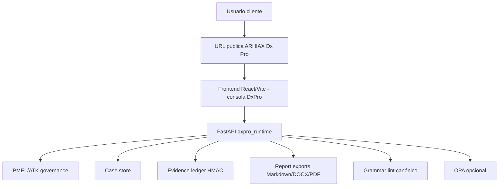

# Plan canónico de redespliegue ARHIAX Dx Pro v1.0

## 1. Propósito doctrinal

Este documento define la instrucción técnica y doctrinal para redesplegar ARHIAX Dx Pro desde cero, usando este repositorio como fuente única de verdad. El objetivo operativo es que el usuario final entre directamente a DxPro y trabaje dentro de una sola consola, un solo runtime y un solo pipeline gobernado.

ARHIAX Dx Pro no debe desplegarse como un portal de selección entre productos. No se debe preguntar al usuario si desea entrar a Dx, Dx Pro, Dx Agent u otra variante. Para efectos comerciales, técnicos y de auditoría, DxPro es el producto visible y el flujo gobernado completo. Cualquier referencia a Dx, Dx Agent o matrices de migración debe tratarse como contexto histórico, material interno o trazabilidad de transición, nunca como navegación de cliente.

## 2. Principios obligatorios

1. **Entrada única:** la URL pública debe abrir directamente la consola ARHIAX Dx Pro.
2. **Pipeline único:** diagnóstico, gobernanza, evidencia, gramática, reporte, aprobación y exportación pertenecen al mismo flujo.
3. **Gobernanza antes de publicación:** ningún informe final debe publicarse si no supera los controles PMEL/ATK, consentimiento, evidencia y gramática canónica.
4. **Informe como entregable premium:** el reporte final debe ser comercial, visual, técnico, extenso, denso y explicativo. No debe limitarse a cuadros.
5. **BPMN y Camunda como evidencia de proceso:** BPMN se muestra como lectura ejecutiva y técnica del flujo; Camunda se presenta solo cuando exista motor, integración o trazabilidad real. No se debe vender automatización Camunda si el caso solo contiene modelado BPMN.
6. **Trazabilidad verificable:** todo caso debe conservar `trace_id`, artefactos, estado del caso, estado gramatical, estado de aprobación y rutas de exportación.
7. **Producción fail-closed:** en producción no se aceptan secretos por defecto ni API sin llaves.

## 3. Fuente de despliegue

Repositorio GitHub:

```text
https://github.com/Marcelo7225/ARHIAX-Dx-Pro.git
```

Directorio local canónico de este repo:

```text
C:\Users\MarceloOrtega\Documents\IDEA CARIBE AGENCIA DE MARKETING\03_CLIENTES_RECURRENTES\SINERGIA CONSULTING GROUP\ARHIAX Dx Pro\dx Pro\runtime\dxpro-runtime
```

Frontend desplegable dentro del repo:

```text
frontend/arhiax-dxpro-site
```

Backend desplegable dentro del repo:

```text
src/dxpro_runtime
```

No usar como fuente de producción carpetas espejo externas, borradores de doctrina o reportes de implementación fuera del repositorio, salvo como material de referencia aprobado.

## 4. Arquitectura de despliegue esperada



El frontend puede publicarse en hosting estático, CDN o detrás de un reverse proxy. El backend debe ejecutarse como servicio persistente con Python 3.11 o superior. En producción, API y frontend pueden convivir bajo el mismo dominio con rutas separadas, o en subdominios diferentes.

Modelo recomendado:

```text
https://dxpro.dominio.com        -> frontend
https://api.dxpro.dominio.com    -> backend FastAPI
```

Modelo alternativo:

```text
https://dxpro.dominio.com        -> frontend
https://dxpro.dominio.com/api    -> backend mediante reverse proxy
```

Si se usa el modelo alternativo, el equipo debe validar que el frontend apunte correctamente al prefijo real de API.

## 5. Variables de entorno obligatorias

Backend local:

```powershell
$env:DXPRO_HOST = "127.0.0.1"
$env:DXPRO_PORT = "8310"
$env:DXPRO_ENV = "development"
```

Backend producción:

```powershell
$env:DXPRO_HOST = "0.0.0.0"
$env:DXPRO_PORT = "8310"
$env:DXPRO_ENV = "production"
$env:DXPRO_EVIDENCE_SECRET = "<secreto-fuerte>"
$env:DXPRO_API_KEYS = "<llave-api-1>,<llave-api-2>"
$env:ANTHROPIC_API_KEY = "<llave-produccion>"
```

Persistencia producción:

```powershell
$env:DXPRO_RUNTIME_ROOT = "<ruta-runtime>"
$env:DXPRO_LEDGER_PATH = "<ruta-persistente>/evidence.jsonl"
$env:DXPRO_CASE_STORE_ROOT = "<ruta-persistente>/cases"
$env:DXPRO_EXPORT_ROOT = "<ruta-persistente>/exports"
$env:DXPRO_POLICY_BUNDLE_PATH = "<ruta-repo>/policy-bundle-pmel-v1.0.0"
```

Frontend:

```powershell
$env:VITE_DXPRO_API_URL = "https://api.dxpro.dominio.com"
```

En entorno local, si no se declara `VITE_DXPRO_API_URL`, la consola usa `http://127.0.0.1:8310`.

## 6. Inventario de APIs, tokens y modelos

Esta sección no debe contener secretos reales. El equipo debe usar nombres de variables, estado de disponibilidad y acciones pendientes. Las llaves reales deben vivir en el gestor de secretos del ambiente, no en Git, no en documentación y no en capturas.

### 6.1 Estado real del repo

| Integración | Variable o mecanismo | Estado en código | ¿Requiere gestión antes de producción? | Acción requerida |
| --- | --- | --- | --- | --- |
| API pública DxPro | `VITE_DXPRO_API_URL` | Existe en frontend | Sí | Definir URL real del backend y compilar frontend con esa variable. |
| API interna protegida | `DXPRO_API_KEYS` y header `X-API-Key` | Existe en backend | Sí | Crear llaves fuertes de 32+ caracteres, rotarlas por ambiente y documentar responsable. |
| Evidencia HMAC | `DXPRO_EVIDENCE_SECRET` | Existe en backend | Sí | Crear secreto fuerte de 32+ caracteres. Sin esto producción debe fallar. |
| Anthropic Claude | `ANTHROPIC_API_KEY` | Existe y es el proveedor LLM activo | Sí | Conseguir, validar y cargar llave de producción. |
| Modelos Claude | `claude-sonnet-4-6`, `claude-opus-4-7` | Están fijados en código | Sí | Confirmar disponibilidad contractual y costos antes del go-live. |
| OpenAlex | `OPENALEX_CONTACT_EMAIL` | Existe como contacto opcional | Recomendado | Definir correo institucional para uso responsable de la API académica. |
| Lens.org | `LENS_API_TOKEN` | Existe como token opcional | Depende del alcance | Conseguir token si se requiere búsqueda de patentes. Sin token, el sistema omite esa búsqueda. |
| OPA externo | `DXPRO_OPA_URL` | Existe como modo opcional | Recomendado en producción gobernada | Desplegar OPA si se quiere evaluación externa de políticas; si no, opera con fallback nativo declarado. |
| HashiCorp Vault | `VAULT_ADDR`, `VAULT_TOKEN`, `VAULT_MOUNT_POINT`, `VAULT_SECRET_PATH` | Existe en capa de secretos | Recomendado | Usar Vault o gestor equivalente para secretos. Si se activa `VAULT_ADDR`, debe existir `VAULT_TOKEN`. |
| Rate limit | `DXPRO_RATE_LIMIT_PER_MINUTE`, `DXPRO_RATE_LIMIT_BURST` | Existe en backend | Sí | Definir límites por ambiente y validar con pruebas de carga ligeras. |
| Persistencia de casos | `DXPRO_CASE_STORE_ROOT` | Existe | Sí | Montar volumen persistente y backup. |
| Exportación de informes | `DXPRO_EXPORT_ROOT` | Existe | Sí | Montar volumen persistente, política de retención y acceso seguro. |
| Ledger de evidencia | `DXPRO_LEDGER_PATH` | Existe | Sí | Montar archivo persistente y backup incremental. |

### 6.2 Modelos LLM: conexión actual y ampliación

El runtime actual usa Anthropic como proveedor LLM conectado. La clase `LlmClient` consume `ANTHROPIC_API_KEY` y llama modelos Claude definidos en código. Los agentes Pro usan principalmente:

```text
claude-sonnet-4-6
claude-opus-4-7
```

Para producción, el equipo debe validar tres cosas antes del despliegue:

1. Que la cuenta Anthropic tenga acceso real a los modelos configurados.
2. Que el presupuesto permita ejecución de diagnósticos, investigación y generación de reportes.
3. Que la política de datos del cliente permita enviar contenido al proveedor LLM.

Si se desean otros proveedores, hoy no basta con declarar una variable nueva. Se debe implementar una capa de proveedor LLM con interfaz común. La recomendación técnica es crear un adaptador con esta forma conceptual:

```text
LlmProvider
├─ AnthropicProvider
├─ OpenAIProvider
├─ GoogleGeminiProvider
├─ AzureOpenAIProvider
└─ LocalProvider
```

Variables recomendadas para una fase futura multimodelo:

| Proveedor | Variables sugeridas | Estado actual | Acción requerida |
| --- | --- | --- | --- |
| Anthropic | `ANTHROPIC_API_KEY`, `DXPRO_LLM_PROVIDER=anthropic`, `DXPRO_LLM_FAST_MODEL`, `DXPRO_LLM_DEEP_MODEL` | Parcial: llave existe, provider no parametrizado | Mantener como proveedor base y luego parametrizar modelos. |
| OpenAI | `OPENAI_API_KEY`, `DXPRO_LLM_PROVIDER=openai`, `DXPRO_OPENAI_MODEL` | No implementado | Diseñar adaptador, pruebas y política de datos. |
| Azure OpenAI | `AZURE_OPENAI_API_KEY`, `AZURE_OPENAI_ENDPOINT`, `AZURE_OPENAI_DEPLOYMENT` | No implementado | Útil para clientes enterprise; requiere adaptador y configuración por tenant. |
| Google Gemini | `GOOGLE_API_KEY` o credenciales de Vertex AI | No implementado | Evaluar solo si hay requerimiento comercial o técnico. |
| Modelo local | `DXPRO_LOCAL_LLM_URL`, `DXPRO_LOCAL_LLM_MODEL` | No implementado | Evaluar para datos sensibles; requiere pruebas de calidad. |

Regla doctrinal: no se deben mezclar modelos sin registrar proveedor, modelo, versión, propósito, costo estimado y restricción de datos en el caso o en el audit pack.

### 6.3 APIs de investigación

El repo ya contiene conectores de investigación para fuentes académicas y patentes:

| Fuente | Uso | Estado | Token | Acción requerida |
| --- | --- | --- | --- | --- |
| OpenAlex | Papers, literatura académica y contraste de investigación | Implementado | No exige token; usa `OPENALEX_CONTACT_EMAIL` como contacto responsable | Definir correo institucional y validar límites de uso. |
| Lens.org | Patentes y señales de propiedad intelectual | Implementado | Requiere `LENS_API_TOKEN` | Conseguir token si el diagnóstico incluye análisis de patentes. |
| Fuentes grises | Material provisto en payload del caso | Implementado | No aplica | Definir criterio de calidad, trazabilidad y consentimiento. |

Si falta token de Lens.org, el sistema no debe fallar el diagnóstico completo; debe registrar que la búsqueda de patentes fue omitida. Si falta contacto OpenAlex, el sistema puede operar, pero no es lo recomendado para producción.

### 6.4 APIs que faltan decidir

Antes de redesplegar para cliente, el equipo debe responder y documentar:

1. **Dominio público:** URL final del frontend y URL final del backend.
2. **Proveedor LLM contractual:** Anthropic confirmado o proveedor alternativo.
3. **Investigación académica:** correo institucional para OpenAlex.
4. **Investigación de patentes:** si se requiere Lens.org y quién consigue el token.
5. **Gestor de secretos:** Vault, secreto del proveedor cloud o variables gestionadas por plataforma.
6. **Almacenamiento de exportables:** disco persistente, bucket privado u object storage.
7. **Descarga de informes:** si se expondrán rutas firmadas, endpoint autenticado o entrega manual.
8. **Autenticación de usuarios finales:** hoy existe API key para API; falta una capa completa de login de usuario si el cliente accederá directamente.
9. **Observabilidad:** logging, métricas, errores y alertas.
10. **Política de retención:** cuánto tiempo conservar casos, evidencias e informes.

### 6.5 Reglas de seguridad para tokens

1. Ningún token real se commitea.
2. Ningún token real se pega en reportes Markdown.
3. Las llaves de producción deben tener 32+ caracteres cuando aplique.
4. Las llaves se rotan por ambiente: local, staging y producción.
5. El equipo debe entregar evidencia de que la app arranca sin exponer secretos en logs.
6. Los reportes de implementación deben decir “configurado”, “faltante” o “no aplica”, nunca revelar el valor.

## 7. Instalación desde cero

Clonar el repositorio:

```powershell
git clone https://github.com/Marcelo7225/ARHIAX-Dx-Pro.git
cd ARHIAX-Dx-Pro
```

Crear entorno Python:

```powershell
python -m venv .venv
.\.venv\Scripts\Activate.ps1
python -m pip install --upgrade pip
python -m pip install -e ".[dev]"
```

Instalar frontend:

```powershell
cd frontend/arhiax-dxpro-site
npm ci
```

Si `npm ci` falla por diferencias de plataforma o lockfile, usar `npm install`, documentar el motivo y no modificar dependencias sin aprobación.

## 8. Pruebas de calidad antes de desplegar

Desde la raíz del repo:

```powershell
python -m pytest -q
```

Desde `frontend/arhiax-dxpro-site`:

```powershell
npm run build
npm run lint
npm test
```

Pruebas complementarias recomendadas:

```powershell
python scripts/smoke_test.py
python scripts/validate_opa.py
```

Control ortográfico y de codificación:

```powershell
rg "Ã|Â|�|t\\+|nforme|exopli|entii|hablamo|usamo|doctrinaymanualdedatos"
```

Si el escaneo encuentra textos en fixtures diseñados para probar mojibake, no deben corregirse sin revisar el propósito del test. Si aparece en documentación, UI, README o informe final, debe corregirse.

## 9. Ejecución local validada

Backend:

```powershell
python -m dxpro_runtime.server
```

Validar:

```text
http://127.0.0.1:8310/
http://127.0.0.1:8310/healthz
http://127.0.0.1:8310/readyz
http://127.0.0.1:8310/docs
```

Frontend:

```powershell
cd frontend/arhiax-dxpro-site
$env:VITE_DXPRO_API_URL = "http://127.0.0.1:8310"
npm run dev
```

El navegador debe abrir la consola DxPro directamente. No debe aparecer una pantalla de selección de producto.

## 10. Endpoints mínimos que deben quedar operativos

Estado:

```text
GET /
GET /healthz
GET /readyz
```

Casos:

```text
GET  /v1/cases
GET  /v1/cases/{case_id}
POST /v1/agents/cases/run
POST /v1/cases/{case_id}/publish
POST /v1/agents/cases/approval
```

Gramática canónica:

```text
POST /v1/agents/grammar/lint
POST /v1/dxpro/agents/grammar/lint
GET  /v1/cases/{case_id}/grammar
```

Reportes:

```text
POST /v1/agents/report/executive
POST /v1/agents/report/render
POST /v1/agents/report/export
```

Gobernanza y evidencia:

```text
GET  /v1/compliance/posture
GET  /v1/evidence
GET  /v1/evidence/verify
GET  /v1/audit-pack/{trace_id}
POST /v1/pmel/evaluate
POST /v1/pmel/run-step
```

## 11. Regla del informe final para clientes

El informe final debe ser tratado como el producto visible de mayor valor. Debe ser tamaño carta, vertical, visualmente premium, comercial y técnico. Debe explicar cada componente con texto completo, no solo tablas o tarjetas.

Estructura mínima recomendada:

1. **Portada ejecutiva:** cliente, fecha, versión, confidencialidad, estado del diagnóstico y promesa de lectura.
2. **Resumen ejecutivo:** hallazgos principales, nivel de madurez, riesgos críticos y oportunidades.
3. **Contexto del diagnóstico:** alcance, roles, fuentes, límites metodológicos y supuestos.
4. **Lectura estratégica:** tensiones del negocio, hipótesis, prioridades y decisiones sugeridas.
5. **Mapa de proceso BPMN:** explicación del AS-IS, nodos críticos, cuellos de botella, handoffs y eventos de control.
6. **Lectura Camunda:** solo incluir si hay motor, modelo ejecutable, trazabilidad técnica o recomendación explícita de automatización. Si no existe integración real, declarar “BPMN como modelo de análisis; Camunda como opción de operacionalización futura”.
7. **Evidencia y trazabilidad:** fuentes, señales, `trace_id`, ledger, decisiones humanas y excepciones.
8. **Gramática canónica ARHIAX:** estado del lint, excepciones, términos bloqueantes, severidad y efecto sobre publicación.
9. **Recomendaciones accionables:** quick wins, rediseño operativo, automatización, gobierno de datos y métricas.
10. **Plan de implementación:** fases, responsables, riesgos, dependencias, indicadores y próximos entregables.

El informe debe incluir explicaciones doctrinales claras sobre qué se muestra, por qué importa y cómo debe interpretarlo el cliente. La estética debe ayudar a vender confianza, no reemplazar el rigor.

## 12. BPMN y Camunda en entregables

BPMN debe aparecer cuando el diagnóstico describa procesos, decisiones, tareas, eventos, esperas, handoffs o controles. Su función en el informe es traducir complejidad operativa a un lenguaje verificable por negocio y tecnología.

Camunda debe aparecer en tres casos:

1. Cuando exista un despliegue o motor Camunda conectado.
2. Cuando el cliente haya solicitado automatización ejecutable.
3. Cuando la recomendación técnica proponga convertir el BPMN en flujo orquestado.

Si no se cumple ninguna condición, no se debe afirmar que el sistema ejecuta procesos en Camunda. Se puede recomendar Camunda como siguiente capa de operacionalización, indicando prerequisitos, esfuerzo y beneficios.

## 13. Publicación y control de salida

Un caso solo puede publicarse cuando:

1. El caso existe y está persistido.
2. La ejecución generó artefacto de reporte.
3. La gramática canónica permite publicar o tiene excepciones aprobadas.
4. El flujo de aprobación humana está resuelto.
5. Las rutas de exportación existen y son verificables.
6. El reporte final incluye estado técnico, trazabilidad y explicación suficiente para cliente.

El endpoint histórico de aprobación no debe usarse para saltarse la gramática. El endpoint explícito `/v1/cases/{case_id}/publish` debe respetar las mismas restricciones.

## 14. Despliegue de producción

El equipo de infraestructura debe:

1. Crear servidor, contenedor o plataforma PaaS para backend.
2. Configurar Python 3.11 o superior.
3. Instalar dependencias con `pip install -e ".[dev]"` o paquete equivalente.
4. Configurar secretos reales, API keys, CORS/reverse proxy, TLS y almacenamiento persistente.
5. Montar backup de `cases`, `exports` y `evidence.jsonl`.
6. Ejecutar pruebas backend y frontend.
7. Construir frontend con `VITE_DXPRO_API_URL` apuntando a la API real.
8. Publicar frontend como entrada única DxPro.
9. Validar salud, readyz, ejecución de caso, lint gramatical, aprobación y exportación.
10. Registrar versión desplegada, commit, fecha, responsable y evidencias de prueba.

## 15. Checklist de aceptación

Antes de declarar el redespliegue terminado:

- [ ] La URL pública abre ARHIAX Dx Pro directamente.
- [ ] No existe selector visible entre Dx, Dx Pro o Dx Agent.
- [ ] `GET /healthz` responde correctamente.
- [ ] `GET /readyz` confirma runtime listo.
- [ ] El frontend puede crear o ejecutar un caso.
- [ ] El caso queda persistido.
- [ ] El lint gramatical se ejecuta y queda persistido.
- [ ] La publicación bloquea errores críticos de gramática.
- [ ] El reporte se exporta en Markdown, DOCX y PDF cuando corresponda.
- [ ] Las rutas de exportación están bajo almacenamiento persistente.
- [ ] El ledger de evidencia existe y puede verificarse.
- [ ] Las pruebas automatizadas pasan.
- [ ] No hay mojibake ni errores de tildes/ñ en UI, README o documentación visible.
- [ ] El equipo dejó informe de implementación con commit, fecha, pruebas y pendientes reales.

## 16. Informe obligatorio del equipo de redespliegue

Cada vez que el equipo termine una fase debe entregar un reporte Markdown en `reportes_implementacion/` con este formato:

```markdown
# Reporte de implementación - ARHIAX Dx Pro

## Fecha y responsable

## Commit desplegado

## Alcance realizado

## Archivos modificados

## Comandos ejecutados

## Resultados de pruebas

## Evidencia funcional

## Riesgos o desviaciones

## Pendientes

## Recomendación del equipo
```

No se acepta “terminado” como reporte. Debe existir evidencia técnica verificable.

## 17. Criterio final

El redespliegue se considera exitoso cuando ARHIAX Dx Pro funciona como producto único, gobernado, trazable y publicable; cuando el usuario entra directamente a la consola DxPro; y cuando el informe final conserva el estándar doctrinal ARHIAX: rigor, belleza comercial, densidad técnica, explicación completa y control de publicación.
