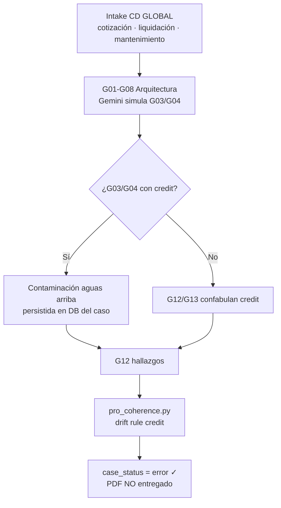

# PRIORIDAD DE LECTURA — Estado operativo Dx Pro

**Leer este documento primero** al clonar el repositorio o incorporarse al equipo.

| Campo | Valor |
|-------|-------|
| **Rama activa** | `dev` |
| **Commit de referencia** | `583c388` — `feat(pro): motor de fenómeno, coherencia fail-closed y resiliencia G12/G13` |
| **Fecha de corte** | 10 de julio de 2026 |
| **Repositorios** | [Mich2Dev/ARHIAX-Dx-Pro](https://github.com/Mich2Dev/ARHIAX-Dx-Pro) · [Marcelo7225/ARHIAX-Dx-Pro](https://github.com/Marcelo7225/ARHIAX-Dx-Pro) |
| **Caso piloto en curso** | **CD GLOBAL (IVANIA RUA)** — construcción / climatización retail (Dollar City) |
| **Producción** | https://arhiax-dx-pro-187668243215.southamerica-east1.run.app/ |

---

## 1. Qué es Dx Pro (en una frase)

**Dx Pro** es el consultor que le dice al implementador **qué hacer y cómo**, con tres piezas:

1. **El problema vale X** — pérdida de productividad / oportunidad (sector o datos de empresa).
2. **La evidencia es Y** — fenómeno nombrado, hipótesis DDF, encuesta, cuellos de botella.
3. **Se resuelve así Z** — TO-BE, roadmap, brief para desarrollo.

Después **Dx se retira**; la implementación es otro equipo.

Referencia metodológica interna: carpeta `caso_ivania_Ray_miller_jefe/` (método Ray Miller — Siete Puntas, formulario descubrimiento, TRs).

---

## 2. En qué punto estamos AHORA (julio 2026)

Estamos en fase de **endurecer el pipeline para que un caso real (Ivania) cierre sin PDF contaminado**.

| Estado | Descripción |
|--------|-------------|
| **Hecho** | Wizard 3 pasos, encuesta adaptativa G09, pipeline G01–G14, guards de coherencia, motor de fenómeno P01–P07, fallback G13, UI de transparencia |
| **En prueba local** | Caso Ivania en `localhost:3002` — fenómeno nombrado OK, encuesta 1/1, síntesis falla o se bloquea en G12/G13 |
| **Bloqueo activo** | Compuertas detectan contenido **`credit` / crédito** ajeno al intake y **detienen el pipeline** (comportamiento correcto) |
| **Causa raíz (código actual)** | Ver sección 5 — **no** es un índice vectorial compartido (aún no existe en este repo) |
| **Pendiente inmediato** | Fallback determinístico **G12**, compuerta en G03/G04, desplegar `dev` a Cloud Run, paquete DX unificado |

---

## 3. Mapa del producto (UI ↔ backend)

### 3.1 Wizard — `front/src/components/features/pro/wizard/`

| Paso UI | Componente | Qué captura |
|---------|------------|-------------|
| **Perfil** | `ProStep1Client.tsx` | Identidad, contacto, síntoma, `expected_outcome`, alcance |
| **Arquitectura** | `ProStep2Scope.tsx` | `survey_mode`, roles, dimensiones, **paquete hipótesis DDF** (`hypothesisPack.ts`) |
| **Validación** | `ProStep3Consent.tsx` | Consentimientos T1/T3 |

### 3.2 Detalle de caso — `front/src/app/dashboard-pro/cases/[id]/page.tsx`

| Bloque UI | Backend |
|-----------|---------|
| **Motor de Fenómeno** | `ProPhenomenonPanel.tsx` → `POST /pro/cases/{id}/analyze` |
| **Descargas .md fenómeno** | `GET .../download/phenomenon-internal` · `.../phenomenon-discovery` |
| **Lifecycle** Arquitectura → Recolección → Fusión IA → Validación HIL | Estados en `ProCase.case_status` |
| **REINTENTAR SÍNTESIS** | `POST /pro/cases/{id}/run` (también desde estado `error`) |

### 3.3 Encuesta pública

- URL: `/survey/pro/{token}`
- Componente: `SurveyForm.tsx`
- Submit: `POST /pro/survey/{token}/submit` (sin auth)

---

## 4. Pipeline de agentes (G01–G14 + P01–P07)

### 4.1 Fases del caso (`ProCase.case_status`)

```
draft → designing → survey_open → running → review_pending → approved → published
                                                      ↘ error
```

### 4.2 Cuándo corre cada bloque

| Fase UI | Agentes | Archivo orquestador |
|---------|---------|---------------------|
| **Arquitectura** (al crear caso) | G01–G08 + G09a/b/c | `back-api/src/api/routers/pro.py` → `_generate_survey_background` |
| **Recolección** | — (solo encuesta) | `ProSurveySession` + respuestas |
| **Fusión IA** | G10a–G14 | `pro.py` → `_run_diagnostic_background` |
| **Fenómeno** (paralelo, manual) | P01–P07 | `phenomenon_engine.py` → `POST .../analyze` |

Listas de herramientas: `back-api/src/api/pipeline/pro_pipeline_tools.py`

- `RESEARCH_DESIGN_TOOLS` = G01–G08 + bpmn_generator  
- `SURVEY_TOOLS` = G09a, G09b, G09c  
- `ANALYSIS_TOOLS` = G10a–G14  

### 4.3 Motor de Fenómeno (Governex / Ray)

| Doc | Código |
|-----|--------|
| `docs/DX_PHENOMENON_ENGINE.md` | `phenomenon_engine.py`, `prompts/phenomenon.py` |
| Persistencia | `input_payload.phenomenon_analysis` |
| Documentos derivados | `pro_phenomenon_documents.py` |

Fenómeno nombrado en caso Ivania (local): **«Saber Operacional Disperso y No Sedimentado»**.

### 4.4 Lo que NO está implementado (arquitectura objetivo Ray)

Ray Miller describe **Layer 4** con cienciométrica → patentométrica → literatura gris → **índice vectorial** → **C09 INTERP Bridge**.

En **este repositorio hoy**:

| Componente objetivo | Estado en `dev` |
|---------------------|------------------|
| Índice vectorial por `case_id` | **No existe** (sin Chroma/Qdrant/embeddings) |
| C09 INTERP Bridge | **No cableado** en `back-api` |
| G03 Cienciómetro / G04 Cartógrafo | **Prompts a Gemini** que *simulan* literatura y benchmarks (`prompts/research.py`) |
| Recuperación real Semantic Scholar / OpenAlex | **No integrada** |

La compuerta de coherencia es **código Python**: `pro_coherence.py` — no un bridge separado.

---

## 5. El problema que estamos solucionando (prioridad #1)

### 5.1 Síntoma visible

Error en UI del caso:

```text
g12_hallazgos: coherencia con el caso: contenido ajeno al caso (credit): el intake no menciona este tema
```

(o el mismo mensaje con `g13_redactor`).

### 5.2 Qué significa

El módulo `pro_coherence.py` compara la salida del LLM contra el **intake anclado** (`build_case_anchors`). Si aparecen patrones de:

| ID regla | Temas bloqueados |
|----------|------------------|
| `credit` | solicitudes de crédito, aprobación de crédito, credit application |
| `vacation` | vacaciones, permisos laborales genéricos |
| `hr_onboarding` | onboarding, nuevo ingreso |

…y el intake **no** menciona esos temas → `PipelineStageFailureError` → caso en **`error`**.

**Esto es intencional (fail-closed).** Antes el PDF salía con basura (vacaciones, RRHH, crédito) hacia el cliente.

### 5.3 Causa raíz en el código ACTUAL (no en Financie·Crédito vía retrieval)

Ray sospecha contaminación del proyecto **ARHIAX Financie·Crédito** vía índice compartido. Esa hipótesis es válida para la **arquitectura futura**, pero en Dx Pro **hoy**:

1. **G03/G04/G06–G08** generan “evidencia” con Gemini en **Arquitectura** y se guardan en `input_payload.research_design` **por caso**.
2. **G12** sintetiza hallazgos desde G07, G08, G11a, G11b (`prompts/reporting.py` — `G12_HALLAZGOS`).
3. Gemini **reintroduce plantillas genéricas** (crédito, banca) o deriva por **«liquidación»** (financiera vs cierre de órdenes de mantenimiento).
4. La compuerta lo atrapa en G12 o G13.

**Verificación para quien clone el repo:**

```bash
# Inspeccionar outputs guardados del caso (Postgres local o script)
python back-api/scripts/audit_all_documents.py
```

Buscar en `pipeline_stages` / `research_design` si **G03 o G04** ya contienen “crédito” **antes** de Fusión IA.

### 5.4 Diagrama del flujo del defecto



---

## 6. Qué ya se implementó para mitigar (commit `583c388`)

| Área | Archivo | Qué hace |
|------|---------|----------|
| Coherencia / drift | `pro_coherence.py` | Anclas por síntoma, sector, fenómeno, incidentes DDF |
| Encuesta single-rater | `pro_survey_mode.py` | 1 respuesta mínima si solo `executive` |
| Roles en español | `ProStep2Scope.tsx`, backend roles | Estratégico / Operativo / Táctico |
| Motor fenómeno | `phenomenon_engine.py` | P01–P07 + downloads MD |
| Fix rutas MD | `pro.py` (orden rutas) | `phenomenon-internal` antes de `download/{target}` |
| Fallback G13 | `pro_g13_fallback.py`, `_run_g13_redactor` | Si Gemini falla → narrativa desde G12/intake |
| Reintentos JSON | `executor.py` | Reintento si JSON inválido / truncado |
| UI error + retry | `cases/[id]/page.tsx` | Botón **REINTENTAR SÍNTESIS** |
| Tests | `test_pro_coherence.py`, `test_pro_g13_fallback.py`, `test_phenomenon_engine.py` | |
| Auditoría | `AUDITORIA_DOCUMENTOS_PRO.json`, `scripts/audit_all_documents.py` | |

### Lo que falta (siguiente sprint)

| Ítem | Prioridad |
|------|-----------|
| **Fallback G12** (`build_g12_fallback_from_g07`) — mismo patrón que G13 | Alta |
| Compuerta coherencia en **G03/G04** al guardar `research_design` | Alta |
| Desplegar `dev` → Cloud Run revisión nueva | Alta |
| Paquete DX unificado (problema + evidencia + solución + handoff dev) | Media |
| Índice literatura por `case_id` (TR Ray Miller) | Roadmap |

---

## 7. Caso piloto: CD GLOBAL (IVANIA RUA)

| Campo | Valor orientativo |
|-------|-------------------|
| Cliente | CD GLOBAL (IVANIA RUA) |
| Sector | Construcción |
| Dominio | Operaciones y producción |
| Síntoma | Lentitud cotización, requisición, liquidación, mantenimiento |
| Encuesta | Single-rater (Ivania / Estratégico) |
| Fenómeno | Saber Operacional Disperso y No Sedimentado |
| Producción (histórico) | UUID `d1356675-4dc3-49ac-b33f-4c3ab1c3a4b0` — PDF viejo contaminado |
| Local (sesión reciente) | UUID `5c47cdc1-4f8e-465b-aed3-e0622e762c6c` |

Datos de llenado wizard: ver conversación / guía alineada a `ProStep1Client.tsx` (10 empleados, Barranquilla, hipótesis DDF con `incidente_texto`).

---

## 8. Desarrollo local (arranque rápido)

```bash
git clone https://github.com/Mich2Dev/ARHIAX-Dx-Pro.git
cd ARHIAX-Dx-Pro
git checkout dev
docker compose up -d
```

| URL | Uso |
|-----|-----|
| http://localhost:3001 | Front Docker |
| http://localhost:3002 | Front dev (`npm run dev -- --port 3002`) si 3000 ocupado |
| http://localhost:8000 | API |

Login seed: `admin@arhiax.com` / ver `.env` (`SEED_*`).

**Tras cambios en `back-api/src`:**

```bash
docker compose restart api
```

---

## 9. Archivos que DEBES conocer

| Prioridad | Ruta | Para qué |
|-----------|------|----------|
| ⭐⭐⭐ | `docs/PRIORIDAD_LECTURA_ESTADO_OPERATIVO_DX_PRO.md` | **Este documento** |
| ⭐⭐⭐ | `back-api/src/api/pipeline/pro_coherence.py` | Compuertas credit/vacation/onboarding |
| ⭐⭐⭐ | `back-api/src/api/pipeline/pro_pipeline_tools.py` | Orquestación G01–G14, fallback G13 |
| ⭐⭐ | `back-api/src/api/routers/pro.py` | API casos, run, analyze, downloads |
| ⭐⭐ | `back-api/src/api/pipeline/phenomenon_engine.py` | Motor P01–P07 |
| ⭐⭐ | `docs/DX_PHENOMENON_ENGINE.md` | Spec fenómeno |
| ⭐⭐ | `AUDITORIA_DOCUMENTOS_PRO.json` | Auditoría entregables |
| ⭐ | `back-api/docs-project/ESTADO_ACTUAL_Y_PIPELINE.md` | Pipeline histórico (parcialmente desactualizado) |
| ⭐ | `back-api/docs-project/FLUJO_AGENTES_COHERENCIA_DIAGNOSTICO.md` | Flujo agentes |

---

## 10. Comandos útiles

```bash
# Tests coherencia + fenómeno + G13 fallback
cd back-api && PYTHONPATH=src python -m pytest tests/test_pro_coherence.py tests/test_pro_g13_fallback.py tests/test_phenomenon_engine.py -q

# E2E Pro (crea caso demo)
python scripts/run_pro_e2e.py

# Auditoría documentos
python back-api/scripts/audit_all_documents.py
```

---

## 11. Glosario rápido

| Término | Significado en Dx Pro |
|---------|----------------------|
| **DDF** | Datos duros del formulario — hipótesis con `incidente_texto` obligatorio |
| **Fail-closed** | Si el LLM falla o contamina → error explícito, no PDF basura |
| **G12** | Sintetizador de hallazgos (`G12_HALLAZGOS`) |
| **G13** | Redactor ejecutivo (`G13_REDACTOR`) |
| **HIL** | Human-in-the-loop — aprobación consultor antes de publicar |
| **Intake** | Datos del wizard paso 1–3 |
| **Kill Critic** | P06 del motor de fenómeno — gates antes de propuesta comercial |
| **PMEL/ATK** | Gobernanza — panel en detalle de caso |

---

## 12. Contacto / contexto de negocio

- **Producto:** diagnóstico que cuantifica el problema, muestra evidencia y define solución — luego Dx se retira.
- **Fuentes de cuantificación:** (1) benchmarks sectoriales G04/G07, (2) datos financieros empresa (wizard futuro).
- **Referencia metodológica:** Ray Miller — fenómeno → evidencia → solución; no parchear PDFs a mano.

---

*Documento mantenido por el equipo Dx Pro. Actualizar al cerrar el caso Ivania o al desplegar fallback G12.*
